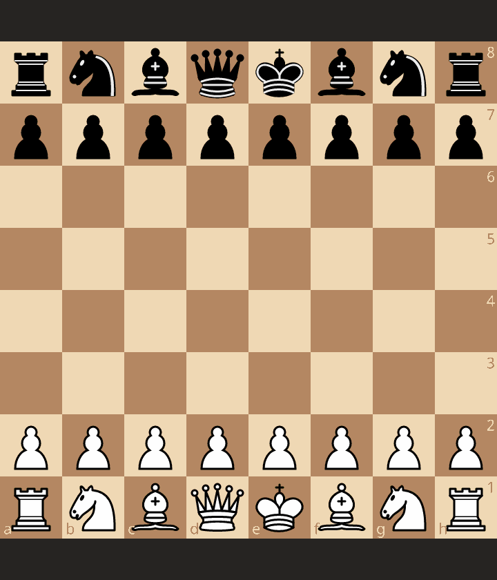

<div align="center">
    <h1 style="font-size: xx-large; font-weight: bold;">Project</h1>
    <a href="#">
        
    </a>
    <a href="#">
        
    </a>
    <br>
</div>

Bresse is a library for use LLM (Large Language Model) like chess AI. This library takes advantage of the fact that LLMs can reproduce a format representing a chess game called PGN. You will find various tools to facilitate experiments, PGN modifications during inference and various useful information.




## Installation

This project uses Poetry for dependency management. To install the dependencies, run the following
command:

```bash
poetry install
```

## Usage

To run the project, use the following commands:

```bash
python src
```

## Contribution

To install the development dependencies, run:

```bash
poetry install --dev
```

To add a new dependency, use:

```bash
poetry add <dependency>
```

For development-specific dependencies, use:

```bash
poetry add --group dev <dependency>
```

## Structure

```bash
├── README.md         # The file you are currently reading
├── htmlcov           # The coverage report folder
├── pyproject.toml    # The poetry configuration file
├── ruff.toml         # The ruff configuration file (linter, formatter)
├── scripts           # Scripts useful for the project (no CI/CD)
├── src               # The source code folder
│   ├── __init__.py   # Can add global variables
│   ├── __main__.py   # The entry point of the project
└── tests             # The tests folder (pytest)
```